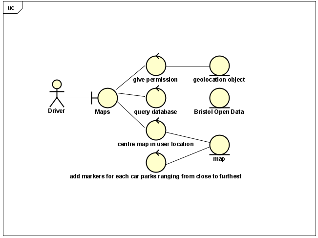

# Requirements

## User Needs

### User stories

As a student I want to see the cheapest carparks near me. 
As a teacher i want to see the clostest carpark near my destination and the prices. 
As a parent i want directions to the car park. 

### Actors

Drivers: Individuals seeking parking use the app to find nearby spaces, compare prices, and estimate overall costs. 
Tourists: Travelers in new cities rely on the app to locate nearby parking, understand pricing, and plan their itineraries. 
Business Travelers: Professionals on business trips use the app to find convenient, cost-effective parking near their meetings or accommodations. 
Event Attendees: People attending events use the app to find nearby parking options, ensuring convenience and comparing prices. 

### Use Cases
 Describe each use case (at least one per team member).
    Give each use case a unique ID, e.g. UC1, UC2, ...
    Summarise these using the use-case template below.

| : UC1  | TODO: Locate nearest car park | 
| -------------------------------------- | ------------------- |
| **Description** | : Locate nearest car park |
| **Actors** | : Driver |
| **Assumptions** | : Browser has geo location/phone.
| **Steps** | : 1. View car parks in the area
 2. Ask user for permission to access their location
 3. Give permission for geo-location
                    4.Retrieve nearest car parks from the data base
                    5. View nearest car parks in the area
| **Variations** | :Any variations in the steps of a use case |
| **Non-functional** | TODO:List of non-functional requirements that the use case must meet. |
| **Issues** | :List of issues that remain to be resolved |

| TODO: UC2  | : Locate nearest car park | 
| -------------------------------------- | ------------------- |
| **Description** |  Locate nearest car park |
| **Actors** | : Buisness Travellers |
| **Assumptions** | : Browser has geo location/phone.
| **Steps** | : 1. View car parks in the area
                    2. Ask user for permission to access their location
                    3. Give permission for geo-location
                    4.Retrieve nearest car parks from the data base
                    5. View nearest car parks in the are
| **Variations** | Any variations in the steps of a use case |
| **Non-functional** | List of non-functional requirements that the use case must meet. |
| **Issues** | List of issues that remain to be resolved |

 Your Use-Case diagram should include all use-cases.

## Software Requirements Specification
### Functional requirements
: 
The system should get premission to access user location via geolocation object. 
The system should query the database for the car parks location from Open Data Bristol. 
The system should centre the map on the user location using the map object. 
The system should add markers for each car park using the map object. 

### Non-Functional Requirements

**NRF1.1** The system should use a default of Bristo City Centre if no user location is avaible. (Realablty) 
**NRF1.2** No security is required (Security) 
**NRF1.3** The app should work on safari/google (compatablity) 
**NRF1.4** The app should work on a mobile phone sized screen (portability) 
**NRF1.5** The source code should be available on GitHub (Maintainability) 
**NRF1.6** The app should respond to the user within 5 seconds (Performance) 
**NRF1.7** The marker should not be so large that they obstruct more than 5% of the map (Usability) 
**NRF1.8** The data should be up to date; less than 1 year old (Functional Suitability) 

: Consider one or more [quality attributes](https://en.wikipedia.org/wiki/ISO/IEC_9126) to suggest a small number of non-functional requirements.
Give each non-functional requirement a unique ID. e.g. NFR1, NFR2, ...

Indicate which UC the requirement comes from.
