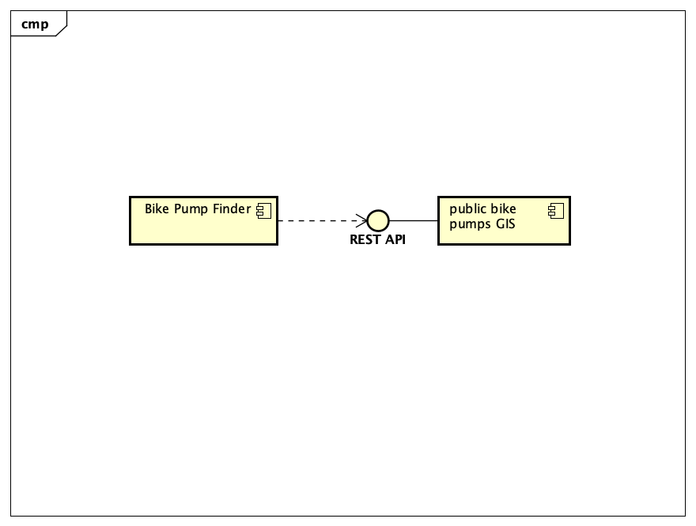

# Implementation

## Introduction
TODO: Describe the system implemented (Describe the dataset. Are there any known issues? Describe any configuration data).
The system that is implemented for designated car parks in Bristol utillzes the data from bristol open data.The dataset includes informantion on many car parks in Bristol, additionally details like the location,opterting hours and capacity as well as fines and fee's 

Incomplete Data: While the dataset provides information for many car parks, there may be instances where certain details are missing or incomplete. This can include missing capacity information or outdated fee structures.
Accuracy: The accuracy of the data is dependent on the source it was obtained from. There may be discrepancies between the provided information and the actual conditions of the car parks.
Updates: The dataset may not be regularly updated, so there could be changes in car park information that are not reflected in the dataset.

## Project Structure
TODO: Provide an outline of the project folder structure and the role of each file within it.
provide a table listing the number of jslint warnings/reports for each module.

## Software Architecture
TODO: Describe the major components of your architecture. Are any particular architectural styles being used?

## Bristol Open Data API
TODO: Document each query to Bristol Open Data

TODO: Repeat as necessary
